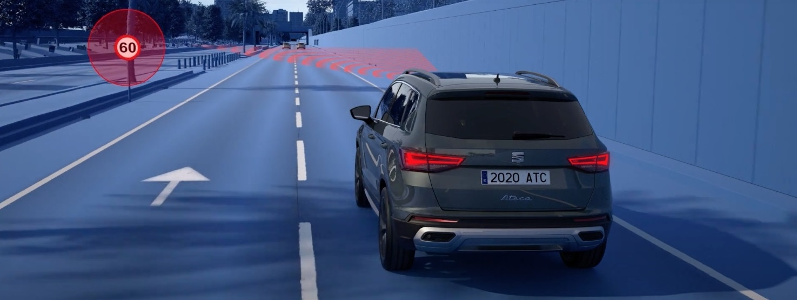
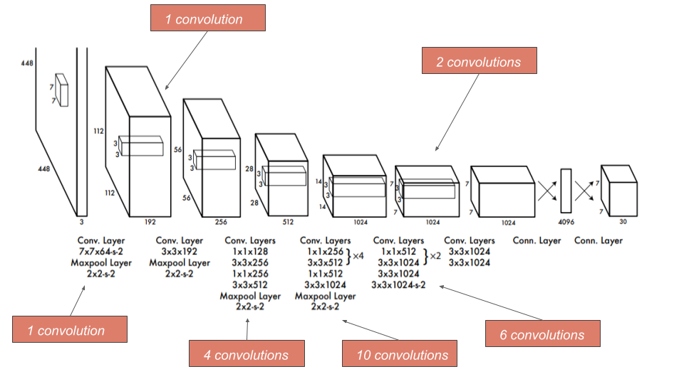

# Traffic Sign Recognition System

<div align="center">
  
</div>

## 🚦 Overview

This project implements a robust traffic sign recognition system using a two-stage deep learning approach:

1. **YOLOv8 Detection**: Processes real-time video streams to detect and localize traffic signs
2. **CNN Classification**: Further classifies detected signs into 43 specific categories

The system can process both real-time camera feeds and pre-recorded videos, making it suitable for various applications including driver assistance systems, autonomous vehicles, and traffic management.

## 📋 Features

- Real-time traffic sign detection and recognition
- Support for 43 different traffic sign classes
- High accuracy through a two-stage detection and classification approach
- Performance optimized for real-time applications
- Visualization tools for model evaluation

## 🧠 Model Architecture

The system uses a hybrid approach combining:

- **YOLOv8**: For initial detection and localization of traffic signs
- **Custom CNN**: For precise classification of the detected signs

<div align="center">
  
  <p><i>YOLOv8 Architecture for Object Detection</i></p>
</div>

## 📊 Datasets

This project was trained on the following datasets:

- **GTSRB** (German Traffic Sign Recognition Benchmark): 43 classes of traffic signs
- **GTSDB** (German Traffic Sign Detection Benchmark): For detection training

## 💻 Requirements

- Python 3.8+
- CUDA Toolkit v11.2.0 (for GPU acceleration)
- cuDNN v8.1.0
- See `requirements.txt` for all Python dependencies

## 🛠️ Installation

1. Clone this repository
2. Create a virtual environment:
   ```
   python -m venv .venv
   .venv\Scripts\activate
   ```
3. Install dependencies:
   ```
   pip install -r requirements.txt
   ```

## 🚀 Usage

### Training

To train the model:

```python
python training.py
```

### Testing 

For real-time detection:

```python
python main.py
```

Adjust the parameters in `main.py` to configure:
- Model training
- Visualization
- Inference on webcam or pre-recorded video

## 📈 Performance

The system achieves high accuracy and real-time performance, making it suitable for integration into driver assistance systems.
